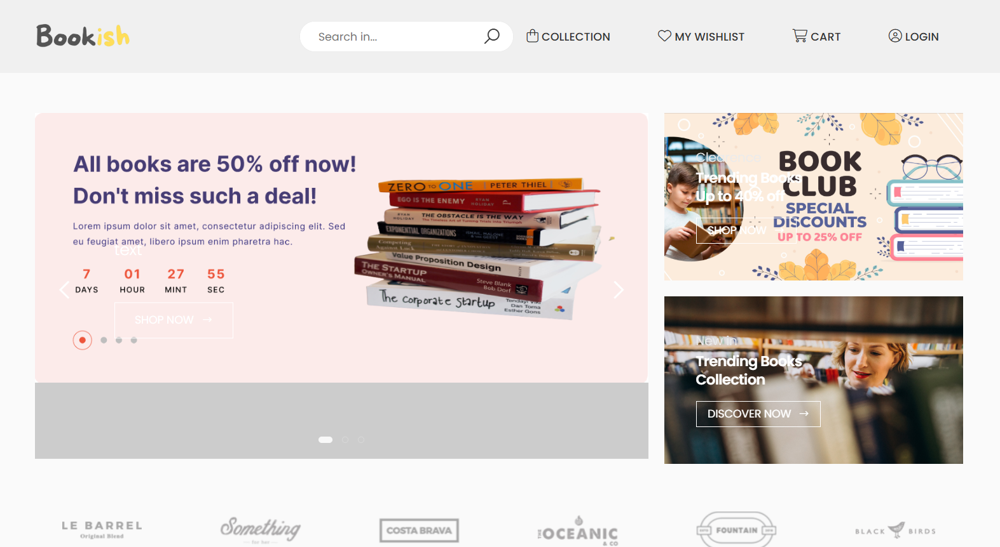
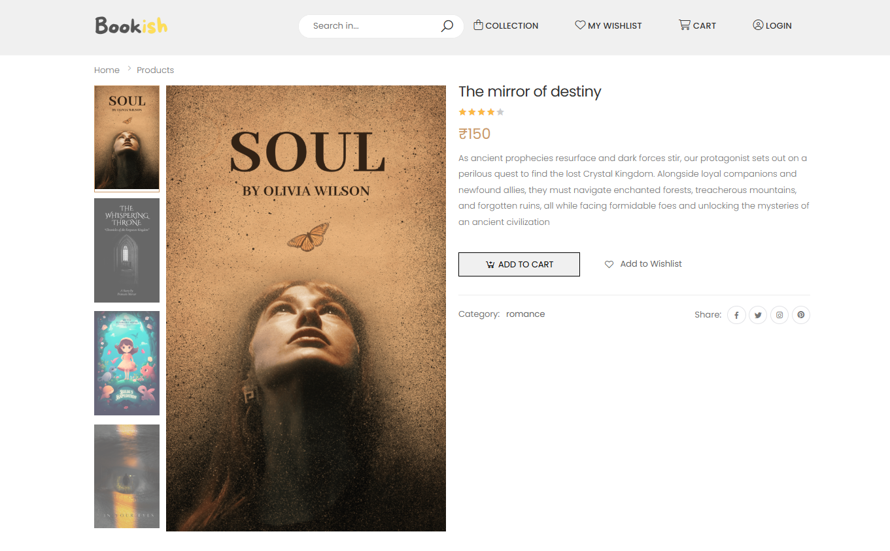
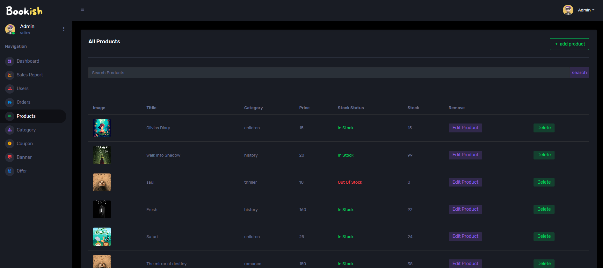

# 📚 Bookish – Your Online Bookstore

**Bookish** is a modern, full-stack eCommerce website for books. It includes a beautiful user interface, secure authentication, product management, shopping cart, admin dashboard with analytics, and much more.

🔗 **Live Site**: [thebookish.online](https://thebookish.online/home)

---

## 📌 Features

- 🛒 Browse and purchase books with real-time cart updates
- 🔐 User authentication and registration
- 🧾 Order placement and order history
- 🧑‍💻 Admin dashboard to manage products and view analytics
- 📈 Graphs showing top-selling books
- 🔍 Search and category filters
- 📦 Fully responsive UI across all devices

---

## 🛠️ Tech Stack

### Frontend:
- Bootstrap
- CSS
- EJS view engine

### Backend:
- Node.js
- Express.js
- MongoDB
- Bcrypt

### Other:
- Chart.js (for admin analytics)
- Multer (for image uploads)
- AWS (Deployment)

---

## 📷 Screenshots

> Add these screenshots in a `screenshots/` folder in your repo

- 🏠 Home Page  
  

- 📘 Product Page  
  

- 📊 Admin Dashboard  
  

---

## 🚀 Getting Started Locally

### 1. Clone the repo

```bash
git clone https://github.com/frederickmorison/bookish.git
cd bookish
```

### 2. 🛠️ Environment Variables Setup

> Create a .env file in the server/ folder and add the following variables:

- 🧁 Session Management
```
SECRET_KEY=your_session_secret
```

- 🧑‍💻 Admin Credentials
```
ADMIN_EMAIL=admin@example.com
ADMIN_PASS=your_admin_password
```

- 🛢️ Database
```
DATABASE_URL=your_mongodb_connection_url
```

- 📞 Twilio (for phone verification)
```
TWILIO_ACCOUNT_SID=your_twilio_sid
TWILIO_AUTH_TOKEN=your_twilio_auth_token
TWILIO_VERIFY_SID=your_twilio_verify_sid
```

- 🔑 OAuth (Google login)
```
CLIENT_ID=your_google_client_id
CLIENT_SECRET=your_google_client_secret
```

- 📬 Mailer ( Nodemailer )
```
MAILER_MAIL=your_email@example.com
MAILER_PASS=your_email_password_or_app_password
```

### 3. Install dependencies
```
npm install
```

### 4. Run the development server
```
npm run start
```
## 📁 Folder Structure
```
└── 📁BOOKISH
    └── 📁controller
        └── 📁adminController
            └── ...
        └── 📁middlewares
            └── ..
        └── 📁userController
            └── ...
    └── 📁models
        └── ...
    └── 📁public
        └── ....
    └── 📁routes
        └── adminRoute.js
        └── userRoute.js
    └── 📁screenshots
        └── dashboard.png
        └── home.png
        └── product.png
    └── 📁services
        └── Paypal.js
    └── 📁util
        └── createInvoice.js
        └── orderNumber.js
        └── walletNumber.js
    └── 📁views
        └── 📁admin
            └── ...
            └── 📁layouts
                └── ...
            └── ...
        └── 📁user
            └── ....
            └── 📁layouts
                └── ...
            └── ...
    └── .gitignore
    └── app.js
    └── package-lock.json
    └── package.json
```

## 📫 Contact
If you like this project or want to collaborate, feel free to connect:

LinkedIn: [www.linkedin.com/in/morisonf]

GitHub: frederickmorison

Email: [frederickmorison@gmail.com]

